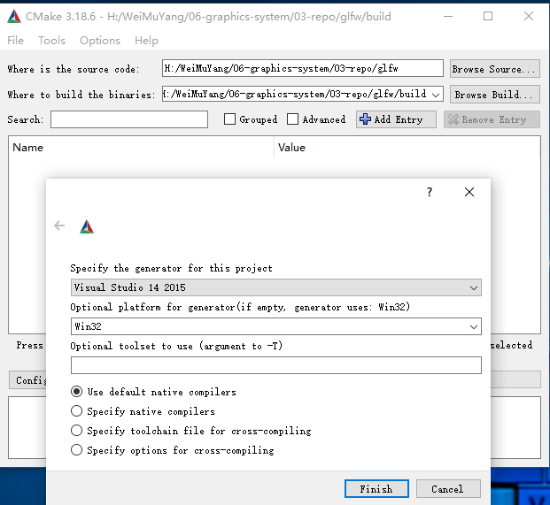
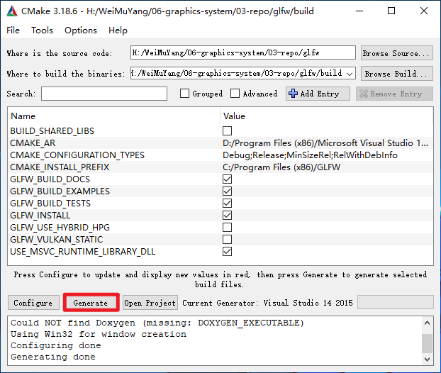
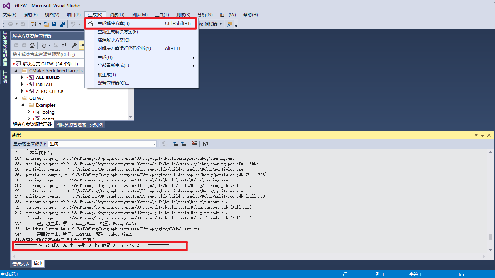
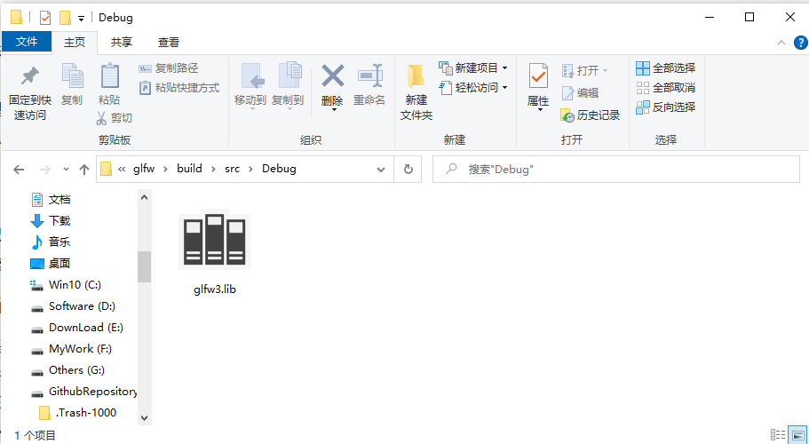
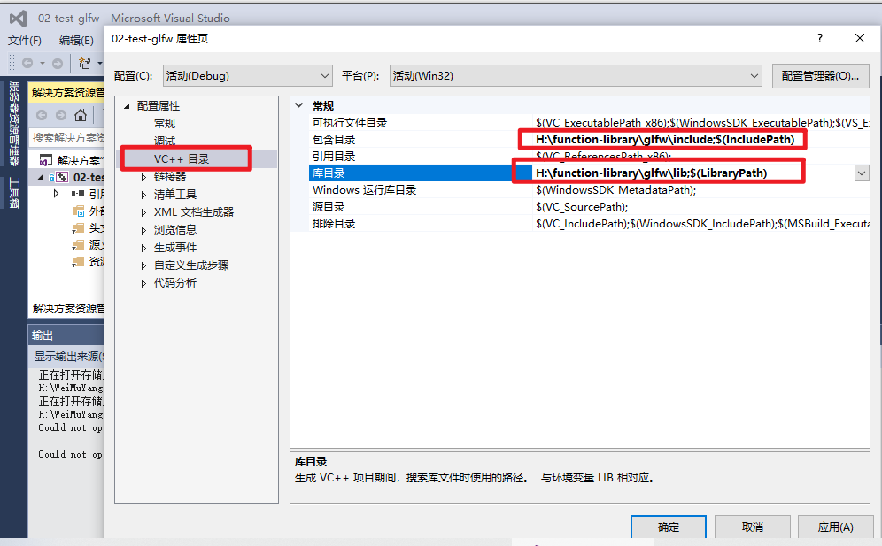
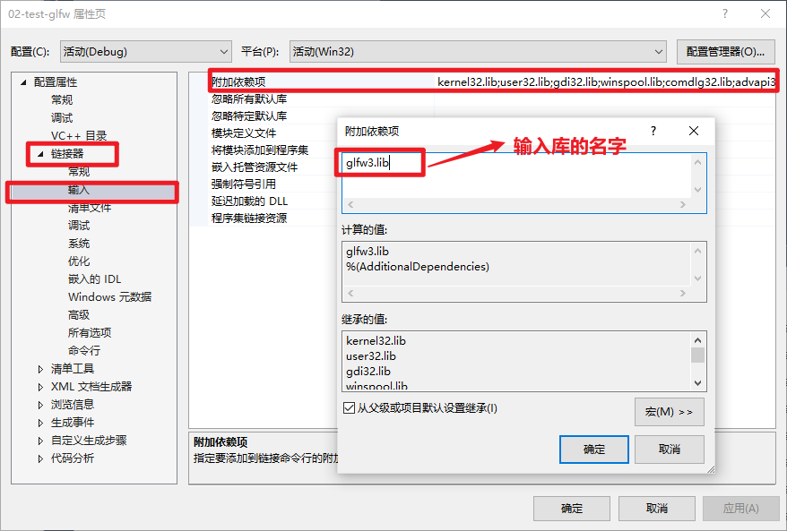

# GLFW下载及配置     

## 1 OpenGL和GLFW的关系   

### 1.1 OpenGL
Open Graphics Library。OpenGL是一个由Khronos组织制定并维护的规范，它仅规定了每个函数该如何执行，以及它们的输出值，但并没有具体实现。

### 1.2 GLFW
Graphics Library Framework。一个符合OpenGL标准的具体的库。

### 1.3 GLAD
在编写程序时，需要动态的确定所需的函数。GLAD用来管理OpenGL的函数指针。   

## 2 GLFW的下载   

GLFW可以从它官方网站的[下载页](http://www.glfw.org/download.html)上获取。GLFW已经有针对Visual Studio 2013/2015的预编译的二进制版本和相应的头文件，但是为了完整性我们将从编译源代码开始。所以我们需要下载**源代码包**。

## 3 GLFW的配置   

### 3.1 安装cmake  

CMake是一个工程文件生成工具。用户可以使用预定义好的CMake脚本，根据自己的选择（像是Visual Studio, Code::Blocks, Eclipse）生成不同IDE的工程文件。这允许我们从GLFW源码里创建一个Visual Studio 2015工程文件，之后进行编译。首先，我们需要从[这里](http://www.cmake.org/cmake/resources/software.html)下载安装CMake。我选择的是Win32安装程序。

### 3.2 构建GLFW    

1. 进入glfw的仓库目录   
2. 创建build文件目录   
3. 打开cmake-gui     

在设置完源代码目录和目标目录之后，点击**Configure(设置)**按钮，让CMake读取设置和源代码。我们接下来需要选择工程的生成器，由于我们使用的是Visual Studio 2015，我们选择 **Visual Studio 14** 选项（因为Visual Studio 2015的内部版本号是14）。CMake会显示可选的编译选项用来配置最终生成的库。这里我们使用默认设置，并再次点击**Configure(设置)**按钮保存设置。保存之后，点击**Generate(生成)**按钮，生成的工程文件会在你的**build**文件夹中。  

### 3.3 生成lib库   

在**build**文件夹里可以找到**GLFW.sln**文件，用Visual Studio 2015打开。因为CMake已经配置好了项目，所以我们直接点击**Build Solution(生成解决方案)**按钮，然后编译的库**glfw3.lib**（注意我们用的是第3版）就会出现在**src/Debug**文件夹内。  

库生成完毕之后，我们需要让IDE知道库和头文件的位置。有两种方法：

1. 找到IDE或者编译器的**/lib**和**/include**文件夹，添加GLFW的**include**文件夹里的文件到IDE的**/include**文件夹里去。用类似的方法，将**glfw3.lib**添加到**/lib**文件夹里去。虽然这样能工作，但这不是推荐的方式，因为这样会让你很难去管理库和include文件，而且重新安装IDE或编译器可能会导致这些文件丢失。

   

2. 推荐的方式是建立一个新的目录包含所有的第三方库文件和头文件，并且在你的IDE或编译器中指定这些文件夹。我个人会使用一个单独的文件夹，里面包含**Libs**和**Include**文件夹，在这里存放OpenGL工程用到的所有第三方库和头文件。这样我的所有第三方库都在同一个位置（并且可以共享至多台电脑）。然而这要求你每次新建一个工程时都需要告诉IDE/编译器在哪能找到这些目录。

   

   

## 参考资料  

1. https://blog.csdn.net/qq_31755927/article/details/86556618    
2. https://learnopengl-cn.github.io/01%20Getting%20started/02%20Creating%20a%20window/  