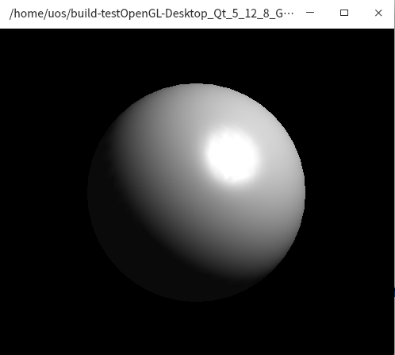

# 基于Linux的OpenGL开发   [img](./img) 

## 1 概述  

为了更好的跨平台的情况下，进行OpenGL的开发，选用qtcreator进行OpenGL的开发和编译，因此，需要配置相应的开发环境以及开发相关的依赖。  主要参考的资料：

- [Linux下配置OpenGL开发环境](https://blog.csdn.net/u013383042/article/details/50344467?utm_medium=distribute.pc_relevant.none-task-blog-2~default~baidujs_title~default-1.no_search_link&spm=1001.2101.3001.4242) （主要参考内容）  
- [Windows上的OpenGL库](https://learnopengl-cn.github.io/01%20Getting%20started/02%20Creating%20a%20window/)  (这个连链接没有对Linux下的连接进行详细介绍)  

## 2 安装函数库 

```shell
# 1、首先安装build-essential软件包，输入命令：
sudo apt-get install build-essential
# 2、安装 OpenGL Library，输入命令：
sudo apt-get install libgl1-mesa-dev
# 3、安装OpenGL Utilities，输入命令：
sudo apt-get install libglu1-mesa-dev
# 4、安装OpenGL Utility Toolkit，输入命令：
sudo apt-get install freeglut3-dev
```

## 3 测试代码    

### 3.1 添加OpenGL库  

```css
// *.pro
QT       += core gui opengl  	/* 添加opengl，有时候可以不加 */
LIBS += -lGL -lGLU -lglut  		# 必须添加 
```

### 3.2 源码测试  

```C++
// main.cpp
#include <GL/glut.h>
#include <stdlib.h>

/* 初始化材料属性、光源属性、光照模型，打开深度缓冲区 */
void init ( void )
{
    GLfloat mat_specular [ ] = { 1.0, 1.0, 1.0, 1.0 };
    GLfloat mat_shininess [ ] = { 50.0 };
    GLfloat light_position [ ] = { 1.0, 1.0, 1.0, 0.0 };

    glClearColor ( 0.0, 0.0, 0.0, 0.0 );
    glShadeModel ( GL_SMOOTH );

    glMaterialfv ( GL_FRONT, GL_SPECULAR, mat_specular);
    glMaterialfv ( GL_FRONT, GL_SHININESS, mat_shininess);
    glLightfv ( GL_LIGHT0, GL_POSITION, light_position);

    glEnable (GL_LIGHTING);
    glEnable (GL_LIGHT0);
    glEnable (GL_DEPTH_TEST);
}

/*调用GLUT函数，绘制一个球*/
void display ( void )
{
    glClear (GL_COLOR_BUFFER_BIT | GL_DEPTH_BUFFER_BIT);
    glutSolidSphere (1.0, 40, 50);
    glFlush ();
}

/* 定义GLUT的reshape函数，w、h分别是当前窗口的宽和高*/
void reshape (int w, int h)
{
    glViewport (0, 0, (GLsizei) w, (GLsizei) h);
    glMatrixMode (GL_PROJECTION);
    glLoadIdentity ( );
    if (w <= h)
        glOrtho (-1.5, 1.5, -1.5 * ( GLfloat ) h / ( GLfloat ) w, 1.5 * ( GLfloat ) h / ( GLfloat ) w, -10.0, 10.0 );
    else
        glOrtho (-1.5 * ( GLfloat ) w / ( GLfloat ) h, 1.5 * ( GLfloat ) w / ( GLfloat ) h, -1.5, 1.5, -10.0, 10.0);
    glMatrixMode ( GL_MODELVIEW );
    glLoadIdentity ( ) ;
}


/* 定义对键盘的响应函数 */
void keyboard ( unsigned char key, int x, int y)
{
    /*按Esc键退出*/
    switch (key)
    {
        case 27:
            exit ( 0 );
            break;
    }
}

int main(int argc, char** argv)
{
    /* GLUT环境初始化*/
    glutInit (&argc, argv);
    /* 显示模式初始化 */
    glutInitDisplayMode (GLUT_SINGLE | GLUT_RGB | GLUT_DEPTH);
    /* 定义窗口大小 */
    glutInitWindowSize (300, 300);
    /* 定义窗口位置 */
    glutInitWindowPosition (100, 100);
    /* 显示窗口，窗口标题为执行函数名 */
    glutCreateWindow ( argv [ 0 ] );
    /* 调用OpenGL初始化函数 */
    init ( );
    /* 注册OpenGL绘图函数 */
    glutDisplayFunc ( display );
    /* 注册窗口大小改变时的响应函数 */
    glutReshapeFunc ( reshape );
    /* 注册键盘响应函数 */
    glutKeyboardFunc ( keyboard );
    /* 进入GLUT消息循环，开始执行程序 */
    glutMainLoop( );
    return 0;
}
```

## 4运行效果  

<center>
     
</center>


## 5 代码位置 

[06-OpenGL-on-linux](../02-code/06-OpenGL-on-linux)  
