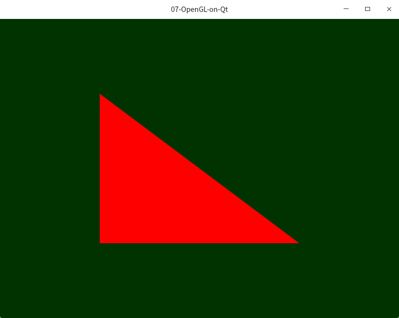

# 基于Qt的OpenGL的开发  [img](./img)

## 1 概述 

在qt5.5及以上已经集成好了OpenGL的函数库，可以加上头文件直接使用。因为Qt对于OpenGL进行了封装，可以进行使用。主要参考资料：  

- [OpenGL + Qt: 0 - 三角形绘制](https://zhuanlan.zhihu.com/p/97457249)  (主要参考资料)    
- [QT5.7中使用OpenGL开发记录（一）](https://blog.csdn.net/lonely_13/article/details/78932905)  (主要参考资料)    
- [QT对OPenGL的封装](https://blog.csdn.net/RaoJohn/article/details/78654417)   (次要参考)   

> ### 流程总结 
>
> 1. 属性和方法：
>
>    - 属性：渲染器程序，顶点等图形信息；
>    - 方法：初始化GL，绘制GL，重置GL  
> 2.  Shader 程序编写（顶点和颜色） → 添加 → 编译链接  
> 3. 顶点信息：创建 → 绑定  → 配置 → 释放顶点和管理顶点的对象 
> 4. 绘制：清空缓冲区 → 添加背景色 → 绑定顶点对象和渲染器  → 绘制三角形 → 释放着色器和管理顶点的对象 
>

## 2 基本介绍  

OpenGL 本身虽然是一个图形库，但是它只负责产生绚丽的图形效果，并不管理用户界面本身，也不与操作系统打交道接受用户的输入，而是依靠其他图形界面库的帮助。

目前能找到的 OpenGL 教程大部分是**使用一些为 OpenGL 打造的工具库**（如 GLUT、glfw 这些），这些库虽然对于发挥 OpenGL 本身的特性都很方便，但是在如果要搭建完整的应用，却十分捉襟见肘。另一方面在 Windows 上安装这些工具库都异常复杂，需要用 CMake + Visual Studio 一顿操作，往往安装就把人吓退了，而 Linux 又会因为显卡驱动的问题，做这种和显卡高度相关的事情会很麻烦。

而 Qt 作为最成熟的跨平台 GUI 库之一，有大量的子模块完成各种交互、多媒体处理、网络等等完整应用所必须的功能，而且其开发的程序几乎可以无缝在不同的操作系统上运行，也有非常简单的安装程序和完善的文档。对于开发 OpenGL 程序来说更重要的是，**从 Qt 5 开始，OpenGL 不再是单独的模块，而是融入了 Qt 核心包中**，在 qmake 的加持下，几乎无需额外配置就能使用。

## 3 源码介绍 

### 3.1  paintingwidget.h  

```C++
// paintingwidget.h
#include <QOpenGLWidget>   			// 界面
#include <QOpenGLContext>			// 上下文
#include <QOpenGLBuffer>			// 缓冲区
#include <QOpenGLFunctions>			// 函数接口
#include <QOpenGLShaderProgram> 	// 着色器
#include <QOpenGLVertexArrayObject>	// 顶点数组对象

class PaintingWidget : public QOpenGLWidget
{
    Q_OBJECT
public:
    explicit PaintingWidget(QWidget *parent = nullptr);

protected:
    void initializeGL();    
    void paintGL();
    void resizeGL(int w, int h);
private:
    QOpenGLBuffer *m_vbo;             // 存储点数据:存放顶点的缓冲区
    QOpenGLVertexArrayObject *m_vao;  // VAO对象 :VAO 则是用于管理多个 VBO 的
    QOpenGLShaderProgram *m_shader;   // 渲染器程序对象
};
```

这里我们需要注意几点

1. 我们重载了三个方法：initializeGL()，paintGL()和 resizeGL()。这三个方法都是来自QOpenGLWidget 的，在 initializeGL() 中我们需要进行初始化，这个方法在 Widget 刚加载时被调用。而在 paintGL() 中进行绘图，每一次绘图请求产生，都会进行一次绘图。最后 resizeGL() 是用于处理窗口大小变化的情况，这个我们会在以后讨论。
2. 我们定义了三个成员变量：m_vbo , m_vao, m_shader。VBO 是指 Vertex Buffer Object，顾名思义就是存放顶点的缓冲区，所有顶点的数据会存入这个对象，交给OpenGL进行绘图。VAO 则是用于管理多个 VBO 的。最后用一个渲染器对象管理渲染器程序。这些对象都是 OpenGL 中设计的，而Qt进行了封装，并提供了一些更方便使用的方法。其详细的概念可以在其他介绍 OpenGL 编程的教程中找到。
3. 构造函数需要接受一个 QWidget 对象为参数，作为图形显示中的父节点，这是所有 QWidget 中都需要的。我们只需要把它传递给父类的构造函数就可以了。

### 3.2 paintingwidget.cpp

```C++
// paintingwidget.cpp
#include "paintingwidget.h"
// Vertex Shader 程序
static const char* VERTEX_SHADER_CODE =
        "#version 330 \n"    						// 指定 GLSL 的版本为 3.30
        "layout(location = 0) in vec3 posVertex;\n" // 将位置于 0 的三维向量命令为 posVertex
        "void main() {\n"			// 程序主体则直接将这个向量传递给 gl_Position，作为输出
        "  gl_Position = vec4(posVertex, 1.0f);\n"
        "}\n";

static const char* FRAGMENT_SHADER_CODE =
        "#version 330\n"
        "out vec4 fragColor;\n"		// Fragment Shader更简单，直接输出红色。
        "void main() {\n"   
        "  fragColor = vec4(1.0f, 0.0f, 0.0f, 1.0f);\n"
        "}\n"; 
// 为了简单起见，我们直接把这两个程序的源程序作为字符串写入源代码，未来我会讨论如何使用 Qt Resource 机制导入 Shader 代码和其他资源。   

PaintingWidget::PaintingWidget(QWidget* parent):
    QOpenGLWidget (parent), m_vbo(nullptr), m_vao(nullptr), m_shader(nullptr){

}

//PaintingWidget::~PaintingWidget(){

//}

// 现在我们可以开始实现 initializeGL() 函数了！这里我们需要做以下两件事：
// 	1. 初始化 Shader Program
// 	2. 初始化顶点缓冲并装入三角形点位置坐标
void PaintingWidget::initializeGL()
{
    QOpenGLFunctions *f = this->context()->functions();
    // Shader程序
    m_shader = new QOpenGLShaderProgram(); 
    // 顶点代码添加到ShaderProgram
    m_shader->addShaderFromSourceCode(QOpenGLShader::Vertex, VERTEX_SHADER_CODE);
    // 颜色代码添加到ShaderProgram
    m_shader->addShaderFromSourceCode(QOpenGLShader::Fragment, FRAGMENT_SHADER_CODE);
    // link()方法编译链接这个m_shader里面的程序。
    if (m_shader->link()) {  
        qDebug("Shaders link success.");
    } else {
        qDebug("Shaders link failed!");
    }
// 需要注意的是，我们在初始化 VBO 对象之前，先初始化了一个 VAO 对象，这么做的好处是，等到后面需要使用时，只需要直接绑定 VAO对象，就能把这个 VBO 对象装入，也不需要重新填充数据。不论是VAO对象还是VBO对象，都需要用 create() 方法传教，用 bind() 绑定，才能进行操作。然后使用 QOpenGLBuffer 的 allocate() 方法把顶点数据填充进去，其第一个参数是填充数据的指针，而第二个是数据的大小（字节）。

    m_vao = new QOpenGLVertexArrayObject();  // VAO 则是用于管理多个VBO的  
    m_vbo = new QOpenGLBuffer(QOpenGLBuffer::Type::VertexBuffer);
    m_vao->create();
    m_vao->bind();

    static const GLfloat VERTEX_DATA[] = {
        -0.5f, -0.5f, 0.0f,
        0.5f, -0.5f, 0.0f,
        -0.5f, 0.5f, 0.0f
    };
    m_vbo->create();
    m_vbo->bind();
    // 填写顶点信息：数据 ，大小
    m_vbo->allocate(VERTEX_DATA, 3*3* sizeof(GLfloat));
	/* QOpenGLWidget 的 context()->functions() 得到 Qt 对 OpenGL 各种函数的封装对象 QOpenGLFunctions
	然后用 glEnableVertexAttribArray() 和glVertexAttribPointer() 函数指定位置 0 的输入如何使用。
	这里 glVertexAttribPointer() 的参数非常关键  
	*/
    f->glEnableVertexAttribArray(0);
    f->glVertexAttribPointer(0, 3, GL_FLOAT, GL_FALSE, 3*sizeof(GLfloat), 0);
    // 初始化完成，释放VBO和VAO
    m_vbo->release();
    m_vao->release();
}
/* glVertexAttribPointer参数解析：
void glVertexAttribPointer(GLuint index, GLint size, GLenum type, GLboolean normalized,  	GLsizei stride, const void* pointer);
	1. index 是所指定的变量位置，也就是前面 Vertex Shader 里面 location = 0 所说的变量位置；
	2. size 是每一个顶点向量的长度，我们提供了三维向量，所以这里取3
	3. type 是向量的数值类型，我们给的是浮点数，所以用GL_FLOAT
	4. normalized 是问是否需要正则化，直接选择 FALSE
	5. stride 是点与点之间在内存上的间隔，因为是三维向量，我们也只提供了位置，没有其他任何信息，这里stride = 3* sizeof(GLfloat)，未来我们会把颜色信息等其他信息放进去，所以会有变化。
	6. pointer 是数据起点位置的偏移量，因为我们传入的 Buffer 一开始就是顶点信息，所以偏移量为 0。
*/

void PaintingWidget::paintGL()
{
    QOpenGLFunctions *f = this->context()->functions();
    // 1. 首先我们用 glClear() 清空显示缓冲，
    f->glClear(GL_COLOR_BUFFER_BIT|GL_DEPTH_BUFFER_BIT);
    // 2. 然后用 glClearColor 画一个背景色，
    f->glClearColor(0.0f, 0.2f, 0.0f, 1.0f);
    m_vao->bind();
    m_shader->bind();
    // 3. 然后调用 glDrawArrays() 函数画三角形
    f->glDrawArrays(GL_TRIANGLES, 0, 3);
    // 4. 最后释放 VAO 和着色器
    m_shader->release();
    m_vao->release();
}
/*
void glDrawArrays(GLenum mode,  GLint first, GLsizei count);
	1. mode 一般就是选择GL_TRIANGLES，因为我们是用三角面片画图，其他选项会有不同的绘制效果。
	2. first是从第几个顶点开始绘制
	3. count则是总共绘制几个顶点 
*/

// 等讨论视角和相机的时候再看它
void PaintingWidget::resizeGL(int w, int h)
{
    Q_UNUSED(w);
    Q_UNUSED(h);
}
```

### 3.3 main.cpp

```C++
// main.cpp
#include "paintingwidget.h"
#include <QApplication>

int main(int argc, char *argv[])
{
    QApplication a(argc, argv);
    PaintingWidget w(nullptr);
    w.resize(800, 600);
    w.show();
    return a.exec();
}
```

## 4 实现效果 

