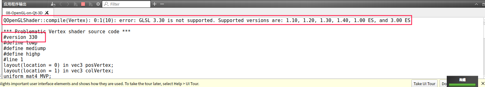
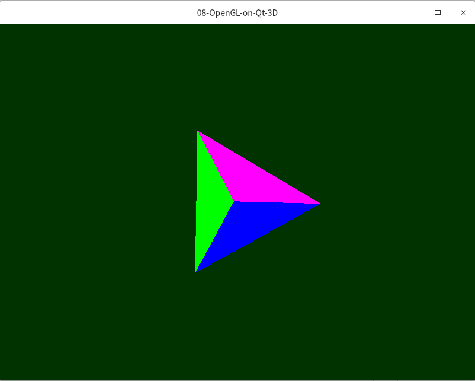
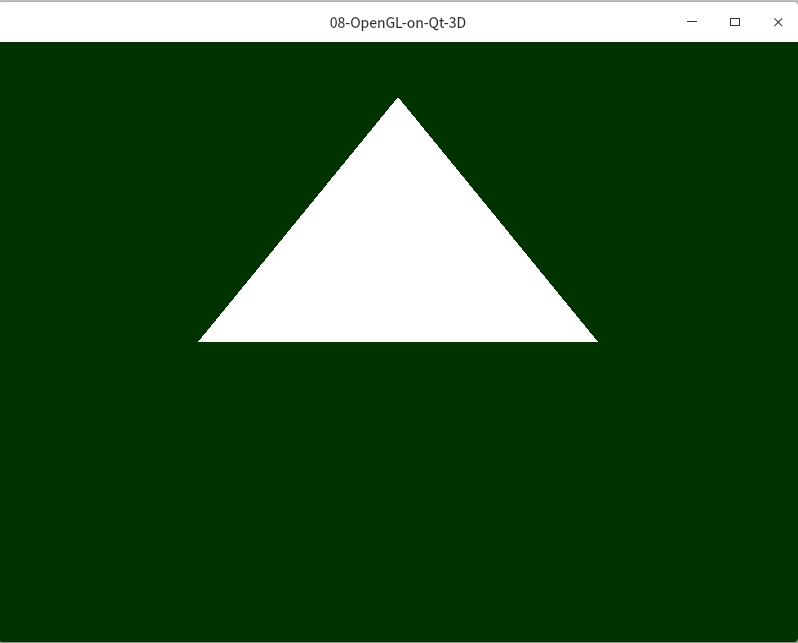

# QOpenGL无法显示3D效果  

## 概述 

为了再跨平台的开发环境下，方便的学习OpenGL，最近使用的是Qt自带的OpenGL的封装包，进行图形的开发，发现我的台式机的QOpenGL无法显示3D效果。

## 问题描述  

### 程序输出报错 

- QOpenGLShader::compile(Vertex): 0:1(10): error: GLSL 3.30 is not supported. Supported versions are: 1.10, 1.20, 1.30, 1.40, 1.00 ES, and 3.00 ES 
- 不支持GLSL 3.30  

### 显示效果  



原来程序的显示效果，和实际的输出效果：

   

## 解决方法  

- [虚拟机中使用OpenGL遇到的错误总结](https://blog.csdn.net/qq_37996632/article/details/100329045)

```shell
# 1 配置glxinfo
sudo apt-get update && sudo apt-get install mesa-utils 
# 2 查看OpenGL 版本  
sudo glxinfo | grep "OpenGL"
# 前面的core profile指的是OpenGL的核心模式版本，后面的ES指的是OpenGL ES版本，这个一般在安卓，ios等设备上用的多
```

1. 在QT中

在实现OpenGL功能的类(继承了QOpenGLWidget的类)中的构造函数里添加：    
```C++
QSurfaceFormat fmt;
fmt.setVersion( 3, 3 );
fmt.setProfile( QSurfaceFormat::CoreProfile );
setFormat( fmt );
QSurfaceFormat::setDefaultFormat( fmt );
```
2. 在glfw中

在main.cpp中加入：   
```C++
glfwWindowHint(GLFW_CONTEXT_VERSION_MAJOR, 3);
glfwWindowHint(GLFW_CONTEXT_VERSION_MINOR, 3);
glfwWindowHint(GLFW_OPENGL_PROFILE, GLFW_OPENGL_CORE_PROFILE);
```
