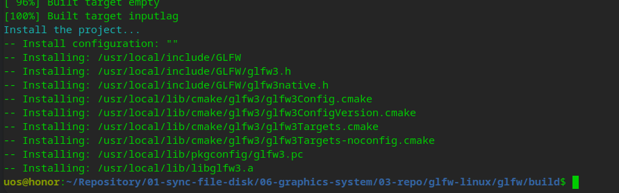

# 基于Linux编译GLFW  [img](./img)   

1. [cmake-error-the-xinerama-library-and-headers-were-not-found](https://discourse.glfw.org/t/cmake-error-the-xinerama-library-and-headers-were-not-found/1100)   
2. [Linux下OpenGL环境搭建(glfw)](https://blog.csdn.net/qq_37996632/article/details/100518269)    

```shell
git clone https://github.com/glfw/glfw.git
mkdir  build && cd build
cmake ..
	# 报错，参考第一个链接，安装sudo apt install xorg-dev
	# CMake Error at CMakeLists.txt:182 (message):
  	# Xinerama headers not found; install libxinerama development package
sudo apt install xorg-dev
cmake ..
make
sudo make install -j8
```



