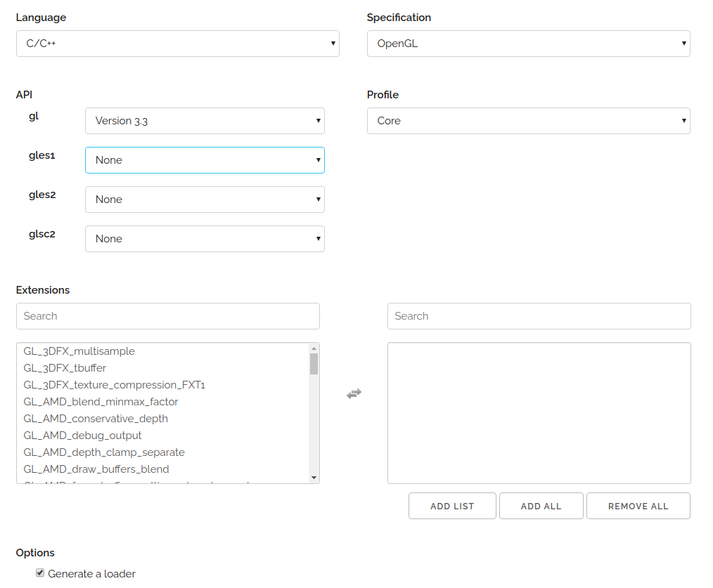
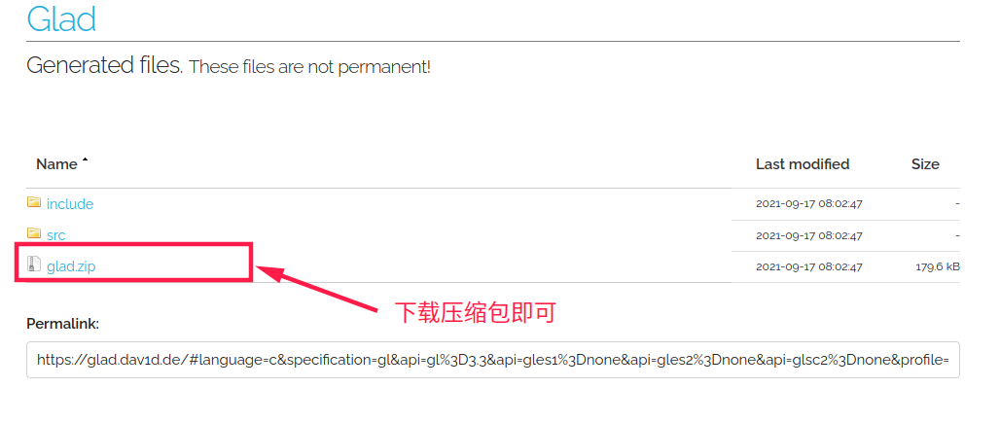

# 基于Linux配置glad  [img](./img)     

参考链接：[Linux下OpenGL环境搭建(glfw)](https://blog.csdn.net/qq_37996632/article/details/100518269) 

下载地址如下：[https://glad.dav1d.de](https://glad.dav1d.de/)，选择需要的版本和模式：

- 选择相应的配置和版本信息



- 下载压缩包    



- 执行命令复制到系统目录  

```shell
cd include
sudo cp -r * /usr/local/include
```

>#### 注意事项 
>
>GLAD里面的`src文件`没有动，只是将头文件添加到了系统的默认目录下，`src`文件中只有一个`glad.c`，如果使用GLAD的话，需要将`glad.c`文件**手动复制到项目目录，然后添加到项目中**。    
