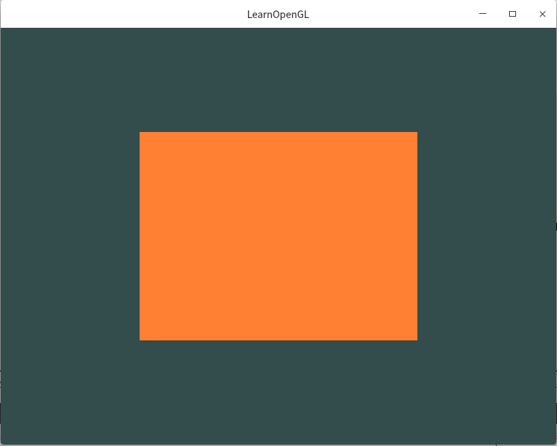

# QtCreator中链接GLFW和GLAD搭建OpenGL环境  [img](./img)      

## 概述 

为了更好的在跨平台下进行OpenGL的学习，最终选择qtctreator开发环境，可以在Windows和Linux下完美切换，随时随地开发电脑就能学习。那么需要搭建OpenGL环境，以及添加GLFW和GLAD相关的依赖。具体GLFW和GLAD的安装参考前面的两篇文档即可，配置Qt Creator参考资料如下：   

- [在 Qt Creator 中链接 GLFW 和 GLAD 搭建 OpenGL 环境](https://blog.csdn.net/KianKwok/article/details/115582093)   
- [10-基于Linux编译GLFW](./10-基于Linux编译GLFW.md)  
- [11-基于Linux配置GLAD](./11-基于Linux配置glad.md)    

## Qt Creator中的配置   

### *.pro文件 

```shell
LIBS += -ldl -lglfw3
# LIBS += -lGL -lm -ldl -lXinerama -lXrandr -lXi -lXcursor -lX11 -lXxf86vm -lpthread -lglfw3
```

### 添加glad.c  

1. 将glad.c 文件从[glad](../03-repo)中找到src目录，将里面的`glad.c`拷贝到项目目录下
2. 在项目中，添加 → 现有文件 → 选择`glad.c`即可  
3. 接下来编译试一下 [测试代码](../02-code/12-OpenGL-on-linux)  ，Linux下测试成功，下一篇测试Win10下  



